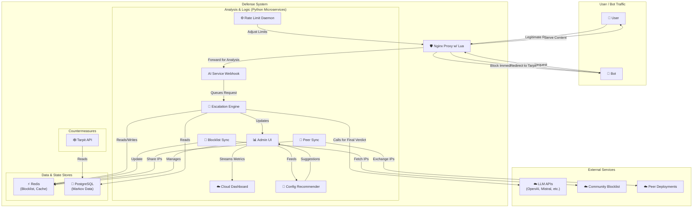

# AI Scraping Defense


[](https://codecov.io/gh/rhamenator/ai-scraping-defense)

This project provides a multi-layered, microservice-based defense system against sophisticated AI-powered web scrapers and malicious bots.

## Key Features

- **Layered Defense:** Uses a combination of Nginx, Lua, and a suite of Python microservices for defense in depth.
- **Intelligent Analysis:** Employs heuristics, a machine learning model, and optional LLM integration to analyze suspicious traffic.
- **Model Agnostic:** A flexible adapter pattern allows for easy integration with various ML models and LLM providers (OpenAI, Mistral, Cohere, etc.).
- **Active Countermeasures:** Includes a "Tarpit API" to actively waste the resources of confirmed bots.
- **End-User Verification:** Optional reCAPTCHA challenge service logs successful verifications for training data.
- **Rate Limiting:** Adaptive per-IP limits updated by a small daemon writing to Nginx.
- **Community Blocklist:** Optional daemon to sync IPs from a shared blocklist service.
- **Public Community Blocklist Service:** Lightweight FastAPI app for contributors to share and fetch malicious IPs.
- **Federated Threat Sharing:** Peer-to-peer sync exchanges blocklisted IPs between deployments.
- **Containerized:** Fully containerized with Docker and ready for deployment on Kubernetes.
- **Multi-Tenant Ready:** Namespace configuration and Redis keys with `TENANT_ID` for easy isolation.
- **Optional Cloud Integrations:** Toggle CDN caching, DDoS mitigation, managed TLS, and a Web Application Firewall using environment variables.
- **Plugin API:** Drop-in Python modules allow custom rules to extend detection logic.
- **Anomaly Detection via AI:** Move beyond heuristics and integrate anomaly detection models for more adaptive security.
- **API Sequence Anomaly Detection:** Markov-based scoring highlights unusual request patterns.
- **Crawler Authentication & Pay-Per-Crawl:** Token registry and usage accounting enable monetization experiments. Whether you actually permit bots to pay for access or keep them blocked is entirely your choice.
- **Payment Gateway Integration:** Multi-provider gateways (`StripeGateway`,
  `PayPalGateway`, `BraintreeGateway`, `SquareGateway`,
  `AdyenGateway`, `AuthorizeNetGateway`, or a generic HTTP backend) handle crawler account creation,
  balance lookups, charging and refunds against external billing APIs.
- **AI Labyrinth Honeypots:** Optional endless maze pages trap persistent bots.
- **Zero Trust Risk & Attack Scoring:** Placeholder modules provide risk analytics hooks.
- **Automated Configuration Recommendations:** AI-driven service that analyzes traffic patterns and suggests firewall and tarpit tuning.
- **Audit Logging:** Sensitive actions are written to a rotating `audit.log` for forensic review.
- **RBAC Controls:** Admin endpoints verify an `ADMIN_UI_ROLE` environment variable and reject non-admin users.
- **Model Version Metrics:** Prometheus gauge `model_version_info` exposes the running ML model version.
- **CORS & CSP Headers:** The Admin UI sets CORS policies and a default Content-Security-Policy header. `ADMIN_UI_CORS_ORIGINS` defaults to `http://localhost` and must list explicit origins; wildcard `*` is rejected when credentials are allowed.
- **Additional Security Headers:** Nginx now sends `Referrer-Policy`, `Permissions-Policy`, and `X-Permitted-Cross-Domain-Policies` headers by default.

## Repository Structure

- `src/` – core Python microservices and shared modules.
- `scripts/` – setup helpers and deployment utilities.
- `rag/` – retrieval-augmented generation resources and training tools.
- `docs/` – project documentation.

## CI Automation: Audits + Autofix

- Workflows provide category audits plus automated fixes with guardrails:
  - `/.github/workflows/master-problem-detection.yml`: orchestrates all categories; input `autofix=true` opens PRs per category.
  - `/.github/workflows/comprehensive-*-audit.yml`: run a single category with `autofix` (defaults to true).
  - `/.github/workflows/autofix.yml`: generic autofix launcher without running audits.
- Guardrails compare pre/post results (flake8, bandit, eslint, yamllint, shellcheck, hadolint, markdownlint, golangci-lint, tflint/tfsec) and run tests if present. If any metric regresses, the workflow opens an issue and does not enable automerge.
- PRs are labeled with `autofix` and the category, and automerge is enabled only when guardrails are clean.
- The legacy `security-autofix.yml` now delegates to the generic autofixer for compatibility.

## Architecture Overview

The following diagram provides a high-level view of how the major components interact. Note that the AI Service merely receives webhook data and enqueues it for the Escalation Engine, which performs the actual analysis. See [docs/architecture.md](docs/architecture.md) for a deeper explanation.


## Threat Model

See [docs/threat_model.md](docs/threat_model.md) for the adversaries and attack vectors this project targets.

## Public Blocklist API

The public blocklist service requires authentication. Set the
`PUBLIC_BLOCKLIST_API_KEY` environment variable and supply its value in the
`X-API-Key` header when calling the `/report` endpoint. Requests missing the
header or using the wrong key receive an HTTP 401 response.

## Beginner Quickstart

Below are platform-specific steps to install the prerequisites and run the helper script. The
script copies `sample.env` (use `sample.env.min` for a minimal config), generates secrets,
installs dependencies, and starts Docker Compose. See
[docs/getting_started.md](docs/getting_started.md) for a deeper walkthrough.

### Linux
1. [Install Docker Engine](https://docs.docker.com/engine/install/) and ensure it is running.
2. Install Python 3.10 or newer (`sudo apt install python3 python3-venv` on Debian-based distros).
3. Clone the repository and execute the quickstart script:
   ```bash
   git clone https://github.com/your-username/ai-scraping-defense.git
   cd ai-scraping-defense
    sudo ./scripts/linux/quickstart_dev.sh
   ```
4. When the containers finish starting, open [http://localhost:5002](http://localhost:5002) to view the Admin UI dashboard.
5. If you see "Cannot connect to the Docker daemon," start the service with
   `sudo systemctl start docker` and verify it with `docker info`.

### macOS
1. Install [Docker Desktop](https://www.docker.com/products/docker-desktop) and start the application.
2. Install Python 3.10+ using [Homebrew](https://brew.sh/): `brew install python`.
3. Clone the repository and run:
   ```bash
   git clone https://github.com/your-username/ai-scraping-defense.git
   cd ai-scraping-defense
    ./scripts/macos/quickstart_dev.zsh
   ```
4. When the containers finish starting, visit [http://localhost:5002](http://localhost:5002) to open the Admin UI.
5. If containers fail to start, confirm Docker Desktop is running by opening the Docker menu.
6. For a step-by-step walkthrough, including security tooling, see the [macOS setup guide](docs/macos_setup.md).

### Windows
1. Install [Docker Desktop for Windows](https://www.docker.com/products/docker-desktop) and ensure it is running.
2. Install Python 3.10+ from [python.org](https://www.python.org/downloads/windows/).
3. In an **Administrator PowerShell** window run:
   ```powershell
   git clone https://github.com/your-username/ai-scraping-defense.git
   cd ai-scraping-defense
   .\scripts\windows\quickstart_dev.ps1
   ```
4. After the containers start, browse to [http://localhost:5002](http://localhost:5002) to access the Admin UI.
5. If Docker commands are not found, verify Docker Desktop is running and try `docker version`.

## Quick Local Setup

Run the automated script after cloning the repository:

```bash
git clone https://github.com/your-username/ai-scraping-defense.git
cd ai-scraping-defense

cp sample.env .env
python scripts/validate_env.py

sudo ./scripts/linux/quickstart_dev.sh   # Linux
./scripts/macos/quickstart_dev.zsh   # macOS

```

For the security testing environment, a helper `scripts/linux/security_setup.sh` script installs all Python requirements and security tools used by `scripts/linux/security_scan.sh`.

On Windows, open an **Administrator PowerShell** window and run `scripts\windows\quickstart_dev.ps1` instead.

The script generates secrets, installs Python requirements with
`pip install -r requirements.txt -c constraints.txt`, re-runs
`python scripts/validate_env.py`, and launches Docker Compose for you.
The stack requires Rust 1.78.0. `mise` (or `rustup`) installs this toolchain automatically.
If you see a warning about `idiomatic_version_file_enable_tools`, silence it with:

```bash
mise settings add idiomatic_version_file_enable_tools rust
```

You can ignore the message if Rust 1.78.0 is already installed.


For a step-by-step explanation of each setup script, see [docs/getting_started.md](docs/getting_started.md).
If you run into errors during setup, consult [docs/troubleshooting.md](docs/troubleshooting.md).

## Manual Local Setup

Follow these steps if you prefer to configure everything yourself.

1. **Clone the Repository:**

    ```bash
    git clone https://github.com/your-username/ai-scraping-defense.git
    cd ai-scraping-defense
    ```

2. **Create Environment File:**
    Copy the example environment file or use the interactive helper to customise settings.

    ```bash
    cp sample.env .env
    # optional guided setup
    python scripts/interactive_setup.py
    ```

    The interactive helper can also launch Docker Compose or deploy to
    Kubernetes when it finishes, if you choose to proceed automatically.
    If you agree when prompted, your secrets are saved in a local SQLite
    database at `secrets/local_secrets.db`. Delete this file or answer **n**
    during the prompt to disable the database and clear stored values.

    Open `.env` and review the defaults. Set `TENANT_ID` for isolated deployments and add any API keys you plan to use. For **production** deployments update `NGINX_HTTP_PORT` to `80` and `NGINX_HTTPS_PORT` to `443`. Use `REAL_BACKEND_HOSTS` to supply a comma-separated list of backend servers for load balancing or `REAL_BACKEND_HOST` for a single destination.
For a full walkthrough of bringing the stack live, review [docs/test_to_production.md](docs/test_to_production.md).

3. **Set Up Python Virtual Environment:**
    Run the setup script to create a virtual environment and install all Python dependencies.
    After the environment is created, install the project requirements with pinned
    constraints:

    ```bash
    pip install -r requirements.txt -c constraints.txt
    ```

    If you plan to use the Kubernetes integrations, install the optional
    dependency set instead:

    ```bash
    pip install -r requirements-kubernetes.txt -c constraints.txt
    ```

    Note: the Kubernetes client currently requires `urllib3<2.4.0`, which
    has known CVEs. Use the Kubernetes requirements only if you accept that
    trade-off until upstream loosens the constraint.

    *On Linux or macOS:*

    ```bash
    sudo bash ./reset_venv.sh
    ```

    *On Windows (PowerShell as Administrator):*

    ```powershell
    .\reset_venv.ps1
    ```

4. **Generate Secrets:**
    Run the secret generation script to create passwords for the database, Admin UI, and other services. It writes a `kubernetes/secrets.yaml` file and prints the credentials to your console. When run with `--update-env` (as in the interactive setup), the script also updates `.env` and writes the database and Redis passwords to `secrets/pg_password.txt` and `secrets/redis_password.txt` for Docker Compose.

    *On Linux or macOS:*

    ```bash
     bash ./scripts/linux/generate_secrets.sh --update-env
     # export credentials to a JSON file
     bash ./scripts/linux/generate_secrets.sh --export-path my_secrets.json
    ```

    *On Windows:*

    ```powershell
     .\scripts\windows\Generate-Secrets.ps1
     # save credentials to a JSON file
     .\scripts\windows\Generate-Secrets.ps1 -ExportPath my_secrets.json
    ```

5. **Enable HTTPS (Optional):**
    Edit `.env` and set `ENABLE_HTTPS=true` with paths to your certificate and key.
    The setup scripts generate a self-signed certificate in `nginx/certs/` if
    one does not exist, which is fine for local testing. Replace it with a
    trusted certificate before production use.

    ```bash
    ENABLE_HTTPS=true
    TLS_CERT_PATH=./nginx/certs/tls.crt
    TLS_KEY_PATH=./nginx/certs/tls.key
    ```

6. **Launch the Stack:**
    Build and start the services with Docker Compose.

    ```bash
    docker-compose up --build -d
    ```

    If you'd like to try the proxy in front of a WordPress site, run `./setup_wordpress_website.sh` (or `./setup_wordpress_website.ps1` on Windows) instead. It launches WordPress and MariaDB containers and sets `REAL_BACKEND_HOST` automatically. For a smaller test, `./setup_fake_website.sh` creates a simple nginx site and updates the variable in the same way.

7. **Access the Services:**
    - **Admin UI:** `http://localhost:5002`
    - **Cloud Dashboard:** `http://localhost:5006`
    - **Cloud Proxy:** `http://localhost:8008`
    - **Prompt Router:** `http://localhost:8009`
    - **Your Application:** `http://localhost:8080`
    - **HTTPS (if enabled):** `https://localhost:8443`

## Optional Features

Several integrations are disabled by default to keep the stack lightweight. You can enable them by editing `.env`:

 - **Web Application Firewall** (`ENABLE_WAF`) – Mounts ModSecurity rules from `WAF_RULES_PATH` for additional filtering. See [docs/waf_setup.md](docs/waf_setup.md) for setup steps.
- **Global CDN** (`ENABLE_GLOBAL_CDN`) – Connects to your CDN provider using `CLOUD_CDN_API_TOKEN` for edge caching.
- **DDoS Mitigation** (`ENABLE_DDOS_PROTECTION`) – The optional `ddos_guard.py` log monitor detects flooding patterns, classifies them as HTTP floods or volumetric attacks, and reports offenders to the local escalation engine. Requests may also be forwarded to an external provider.
- **Managed TLS** (`ENABLE_MANAGED_TLS`) – Automatically issues certificates via `TLS_PROVIDER` with contact email `TLS_EMAIL`.
- **CAPTCHA Verification** – Populate `CAPTCHA_SECRET` to activate reCAPTCHA challenges.
- **Fail2ban** – Start the `fail2ban` container to insert firewall rules based on blocked IPs. See [docs/fail2ban.md](docs/fail2ban.md) for details.
- **LLM Tarpit Pages** (`ENABLE_TARPIT_LLM_GENERATOR`) – Use an LLM to generate fake pages when a model URI is provided.
- **Admin UI Two-Factor Auth** – Set `ADMIN_UI_2FA_SECRET` (or `ADMIN_UI_2FA_SECRET_FILE`) and provide a TOTP in the `X-2FA-Code` header.

## Project Structure

- `src/`: Contains all Python source code for the microservices.
- `kubernetes/`: Contains all Kubernetes manifests for production deployment.
- `nginx/`: Nginx and Lua configuration files.
- `docs/`: Project documentation, including architecture and data flows. See
  [docs/antivirus.md](docs/antivirus.md) if your antivirus flags any files.
- `test/`: Unit tests for the Python services.
- `sample.env`: Template for local development configuration. See the [Configuration Reference](docs/configuration.md) for a description of every variable.
- `Dockerfile`: A single Dockerfile used to build the base image for all Python services.
- `jszip-rs/`: Rust implementation of the fake JavaScript archive generator.
- `markov-train-rs/`: Rust implementation of the Markov training utility.

When running in the security testing environment, execute `./scripts/linux/security_setup.sh` first to install all dependencies required for the unit tests and security scans.

### Running Multiple Tenants

Create an `.env` file per tenant with a unique `TENANT_ID` and port mappings.
Launch each stack with a distinct project name so Docker Compose keeps the
services isolated:

```bash
docker compose --env-file .env.siteA -p siteA up -d
docker compose --env-file .env.siteB -p siteB up -d
```

Redis keys and SQLite records are automatically prefixed with the tenant ID.
## Configuring AI Models

The detection services load a model specified by the `MODEL_URI` value in `.env`. Examples include a local scikit-learn file or an external API:

```bash
MODEL_URI=sklearn:///app/models/bot_detection_rf_model.joblib
MODEL_URI=openai://gpt-4-turbo
MODEL_URI=mistral://mistral-large-latest
```

For remote providers, set the corresponding API key in `.env` (`OPENAI_API_KEY`, `MISTRAL_API_KEY`, etc.).

When referencing a local file with the `sklearn://` scheme, the model must reside
in a trusted directory. By default, the adapters only load models from the
`models/` folder (override with the `TRUSTED_MODEL_DIR` environment variable).
Files outside this directory are ignored to avoid executing untrusted code.

All LLM requests from the Escalation Engine are sent to the **Prompt Router**. The
router constructs the final target URL from `PROMPT_ROUTER_HOST` and
`PROMPT_ROUTER_PORT` and decides whether to use a local model or forward the
prompt to the cloud proxy. The default port values are shown in
`sample.env`:

```env
# excerpt from sample.env
PROMPT_ROUTER_PORT=8009
PROMETHEUS_PORT=9090
GRAFANA_PORT=3000
```

## Model Adapter Guide

The [Model Adapter Guide](docs/model_adapter_guide.md) explains all available schemes and how to extend the system with new providers.

## Markov Training Utility (Rust)

`markov-train-rs` contains a high-performance implementation of the corpus loader.
It exposes a `train_from_corpus_rs` function callable from Python via PyO3.
The repository is pinned to **Rust 1.78.0** via `rust-toolchain.toml`. Ensure
that toolchain is installed before building the Rust crates.

Build the extension with Cargo:

```bash
cd markov-train-rs
cargo build --release
```

Once built, call the function to populate PostgreSQL:

```bash
python -c "import markov_train_rs, os; markov_train_rs.train_from_corpus_rs(os.environ['CORPUS_FILE_PATH'])"
```

Ensure the usual `PG_HOST`, `PG_PORT`, `PG_DBNAME`, `PG_USER`, and `PG_PASSWORD_FILE` environment variables are set so the library can connect to PostgreSQL.

## JS ZIP Generator (Rust)

`jszip-rs` provides an optional Rust backend for generating the large fake JavaScript archives used by the tarpit. It can be built with Cargo:

```bash
cd jszip-rs
cargo build --release
```
The build requires Python development headers (e.g. `python3-dev` on Debian-based systems) so that PyO3 can link against `libpython`.

The resulting `jszip_rs` Python module will be used automatically if available.

## Training the Detection Model

The `src/rag/training.py` script now accepts a `--model` flag to select which
machine learning algorithm to train. Supported values are `rf` (RandomForest,
default), `xgb` (XGBoost), and `lr` (Logistic Regression). Example usage:

```bash
python src/rag/training.py --model xgb
```

This flexibility makes it easy to experiment with different classifiers.

## Quick Kubernetes Deployment

Run the helper script to deploy everything to Kubernetes in one step. Ensure the
`kubernetes/secrets.yaml` file already exists (generate it with
`scripts/linux/generate_secrets.sh` or the interactive setup):

```bash
./scripts/linux/quick_deploy.sh       # or .\scripts\windows\quick_deploy.ps1 on Windows
```

If you're on Windows, run `scripts\windows\quick_deploy.ps1` from an **Administrator PowerShell** window.

The script applies all manifests using `kubectl`; it does not generate secrets.

## Manual Kubernetes Deployment

For a detailed, step-by-step guide see [docs/kubernetes_deployment.md](docs/kubernetes_deployment.md). The `deploy.sh` and `deploy.ps1` scripts provide a manual approach if you need more control.

## Cloud Deployment (GKE Example)

To deploy the stack to a managed Kubernetes service such as Google Kubernetes Engine, follow the instructions in [docs/cloud_provider_deployment.md](docs/cloud_provider_deployment.md). Convenience scripts are provided for automation:

```bash
./gke_deploy.sh       # or .\gke_deploy.ps1 on Windows
```

### GitHub Actions Runner Deployment

A workflow named `linux-stack.yml` now demonstrates a deployment to the GitHub runner environment. Trigger it from the **Actions** tab to see a deployment artifact uploaded. See [docs/github_actions_deployment.md](docs/github_actions_deployment.md) for more information.


## Load Testing Helpers

To experiment with the stack's performance under load, run the helper script:

```bash
./setup_load_test_suite.sh (or ./setup_load_test_suite.ps1 on Windows)
```

It installs common open-source tools such as **wrk**, **siege**, **ab**, **k6**, and **locust**. Use them responsibly and only against environments you control.

After installing the tools, you can run a basic stress test using the provided scripts:

```powershell
./stress_test.ps1 -Target http://your-linux-host:8080 -VUs 50 -DurationSeconds 30
```

```bash
./stress_test.sh http://your-linux-host:8080
```

## Security Scan Helper

The optional scripts `scripts/linux/security_scan.sh` and `scripts/windows/security_scan.ps1` automate tools such as **Nmap**, **Nikto**, and **Trivy** to perform vulnerability checks. Install these dependencies and run them with the appropriate privileges so network scans can complete. See [docs/security_scan.md](docs/security_scan.md) for more details. **Use these scripts only on systems you own or have permission to test.**

## Security Alert Management

The `scripts/manage_alerts_issues_prs.py` script helps manage security alerts, issues, and pull requests by identifying and consolidating duplicates, diagnosing error-state alerts, and keeping your repository organized.

**Quick Start:**

```bash
# Install dependencies
pip install requests PyGithub

# Run in dry-run mode (no changes)
export GITHUB_TOKEN="your_github_token"
./scripts/run_alert_management.sh

# Or run directly with Python
python scripts/manage_alerts_issues_prs.py \
  --owner rhamenator \
  --repo ai-scraping-defense \
  --dry-run
```

**What it does:**
- ✅ Consolidates duplicate security alerts (code scanning, secret scanning, Dependabot)
- ✅ Closes duplicate issues and PRs with superseding notes
- ✅ Diagnoses and suggests fixes for error-state alerts
- ✅ Generates comprehensive reports of all actions

The script intelligently groups items by their essential properties (problem description, not file paths or IDs), ensuring that duplicate alerts affecting different files are properly consolidated. All closed items receive notes referencing the primary item.

**Documentation:**
- **Quick Start:** [QUICK_START_ALERT_MANAGEMENT.md](QUICK_START_ALERT_MANAGEMENT.md)
- **Detailed Guide:** [docs/alert_management_guide.md](docs/alert_management_guide.md)
- **Technical Docs:** [scripts/ALERT_MANAGEMENT_README.md](scripts/ALERT_MANAGEMENT_README.md)

You can also run this automatically via GitHub Actions (see `.github/workflows/manage-alerts.yml`).

## Monitoring Stack

Docker Compose includes a small Prometheus and Grafana setup. Prometheus scrapes
the Python services every 15 seconds using `monitoring/prometheus.yml`, and
Grafana exposes dashboards on `${GRAFANA_PORT:-3000}`.

```env
# excerpt from sample.env
PROMETHEUS_PORT=9090
GRAFANA_PORT=3000
```

- **Prometheus UI:** [http://localhost:${PROMETHEUS_PORT:-9090}](http://localhost:9090) shows raw metrics and scrape targets.
- **Grafana UI:** [http://localhost:${GRAFANA_PORT:-3000}](http://localhost:3000) (default login `admin` / `admin`). You can import a dashboard from Grafana's library or create your own to monitor request rates and response times.

The stack also runs a `watchtower` container that checks for image updates every
minute and restarts services automatically. Remove or comment out the
`watchtower` section in `docker-compose.yaml` if you prefer manual updates.
