# System Architecture

The AI Scraping Defense system is designed as a distributed, microservice-based architecture. This design promotes scalability, resilience, and separation of concerns. The system is composed of several key components orchestrated by Docker Compose for local development and Kubernetes for production.

## Core Components

- **Nginx Proxy:** The public-facing entry point for all traffic. It uses Lua scripting for high-performance initial request filtering, such as checking against a blocklist in Redis. Suspicious requests are asynchronously forwarded to the AI Service for deeper analysis.

- **Python Services:** A collection of specialized microservices that form the "brain" of the system. All Python services are built from a single, unified `Dockerfile` to ensure consistency and reduce build times.

  - **AI Service:** A simple webhook that receives suspicious request data from Nginx and queues it for analysis by the Escalation Engine.
  - **Escalation Engine:** The central analysis component. It runs a multi-stage pipeline to score requests, using heuristics, a machine learning model, and optionally a powerful LLM for a final verdict.
  - **Tarpit API:** Provides a set of "tarpits" (e.g., zip bombs, slow responses, nonsensical data) designed to waste the resources of confirmed malicious bots.
  - **Admin UI:** A FastAPI-based web interface for monitoring system metrics and viewing the blocklist. Configuration is loaded from environment variables, though a couple of runtime-only options (log level and escalation endpoint) can be tweaked via the interface.

- **Data Stores:**
  - **Redis:** An in-memory data store used for high-speed operations like caching, managing the IP blocklist, and tracking request frequencies.
  - **PostgreSQL:** A relational database used for storing the persistent data needed for the Markov chain text generator.

- **Background Jobs:**
  - **Corpus Updater & Markov Trainer:** Cron jobs that periodically fetch new text data and retrain the Markov model to keep the tarpit content fresh.
  - **Archive Rotator:** A simple service that manages the "zip bomb" archives used by the Tarpit API.

## Architecture Diagram

This diagram illustrates the high-level relationships between the system's components. It's perfect for providing a visual overview in a presentation.



## Real-time Request Processing Flow

```mermaid
graph TD
    User["👤 User"] -->|Legitimate Request| Nginx
    Bot["🤖 Bot"] -->|Suspicious Request| Nginx

    Nginx["🛡️ Nginx Proxy w/ Lua"] -->|Block Immediately| Bot
    Nginx -->|Forward for Analysis| AIService["AI Service Webhook"]
    Nginx -->|Serve Content| User
    Nginx -->|Redirect to Tarpit| Bot

    AIService -->|Queues Request| EscalationEngine["🧠 Escalation Engine"]
    EscalationEngine -->|Reads/Writes| Redis["⚡ Redis\n(Blocklist, Cache)"]
    EscalationEngine -->|Reads| Postgres["🐘 PostgreSQL\n(Markov Data)"]
    EscalationEngine -->|Calls for Final Verdict| LLM["☁️ LLM APIs\n(OpenAI, Mistral, etc.)"]
    EscalationEngine -->|Updates| AdminUI["📊 Admin UI"]

    AdminUI -->|Manages| Redis

    TarpitAPI["🕸️ Tarpit API"] -->|Reads| Postgres
```



## Key Data Flows

```mermaid
graph TD
    subgraph "User / Bot Traffic"
        direction LR
        User["👤 User"]
        Bot["🤖 Bot"]
    end

    subgraph "Defense System"
        direction TB
        Nginx["🛡️ Nginx Proxy w/ Lua"]

        subgraph "Analysis & Logic (Python Microservices)"
            direction LR
            AIService["AI Service Webhook"]
            EscalationEngine["🧠 Escalation Engine"]
            AdminUI["📊 Admin UI"]
        end

        subgraph "Countermeasures"
            TarpitAPI["🕸️ Tarpit API"]
        end

        subgraph "Data & State Stores"
            direction LR
            Redis["⚡ Redis\n(Blocklist, Cache)"]
            Postgres["🐘 PostgreSQL\n(Markov Data)"]
        end
    end

    subgraph "External Services"
        LLM["☁️ LLM APIs\n(OpenAI, Mistral, etc.)"]
    end

    User -->|Legitimate Request| Nginx
    Bot -->|Suspicious Request| Nginx

    Nginx -->|Block Immediately| Bot
    Nginx -->|Forward for Analysis| AIService
    Nginx -->|Serve Content| User
    Nginx -->|Redirect to Tarpit| Bot

    AIService -->|Queues Request| EscalationEngine
    EscalationEngine -->|Reads/Writes| Redis
    EscalationEngine -->|Reads| Postgres
    EscalationEngine -->|Calls for Final Verdict| LLM
    EscalationEngine -->|Updates| AdminUI

    AdminUI -->|Manages| Redis

    TarpitAPI -->|Reads| Postgres
```


## Optional Cloud Integrations

The stack can integrate with external services for enhanced protection. Each integration is controlled via environment variables and is disabled by default:

- **Global CDN (`ENABLE_GLOBAL_CDN`)** – Connects to a provider such as Cloudflare for worldwide edge caching.
- **DDoS Mitigation (`ENABLE_DDOS_PROTECTION`)** – Reports suspicious traffic to a third-party anti-DDoS service.
- **Managed TLS (`ENABLE_MANAGED_TLS`)** – Automatically requests and renews TLS certificates.
- **Web Application Firewall (`ENABLE_WAF`)** – Applies additional request filtering using customizable rules.

These features are optional so deployments remain lightweight when cloud services are unavailable.

## Local IP Banning with Fail2ban

Fail2ban monitors the shared Nginx logs and inserts firewall rules using
`iptables` or `nftables` when an IP is blocked by the Lua script. The log line
`check_blocklist: Blocking IP <ip>` triggers a temporary ban matching the Redis
blocklist TTL.

### Activation Steps

1. **Docker Compose** – Ensure the `fail2ban` service is enabled and start it
   alongside the other containers:
   ```bash
   docker compose up -d fail2ban
   ```
2. **Kubernetes** – Apply `nginx-logs-pvc.yaml`, update the `nginx-deployment`
   to mount this volume, then deploy `fail2ban-deployment.yaml`.

Fail2ban runs with `NET_ADMIN` and `NET_RAW` capabilities so it can modify host
firewall rules. Review these permissions and adjust `bantime` and `findtime`
within the jail to fit your security policy.
