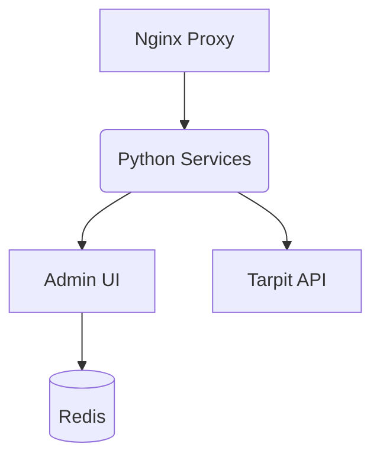

# AI Scraping Defense Stack

Welcome to the official documentation for the **AI Scraping Defense Stack** — a modular, containerized system for detecting and deterring AI-based web scrapers, bots, and unauthorized data miners.

## Project Goal

The project’s core objective is to establish a resilient and adaptable multi-tiered defense framework against automated threats, with a focus on advanced AI-driven web scrapers. Leveraging a microservice architecture enables efficient detection, profiling, and mitigation of hostile bot activity—while maintaining a seamless experience for genuine human users. By integrating specialized tactics such as tarpit APIs, honeypot traps, and behavioral analytics, the system safeguards web applications and alleviates operational strain on servers and server administrators.

## Overview

This project includes:

- FastAPI-based tarpit to delay or confuse bots
- ZIP archive honeypots containing fake JavaScript traps
- Auto-generated decoy API endpoints to mislead scrapers
- Escalation engine for behavioral analysis (local + LLM)
- Admin UI with real-time metrics
- Markov-based fake text generators
- Lua/NGINX filtering and GoAccess log reporting
- Fail2Ban compatibility and webhook alerts
- ✅ Anomaly Detection via AI – Move beyond heuristics and integrate anomaly detection models for more adaptive security.

> This stack is modular, extensible, and designed for privacy-conscious and resource-constrained FOSS projects.

## Repository Structure

- `src/` – core Python microservices and shared modules.
- `scripts/` – setup helpers and deployment utilities.
- `rag/` – retrieval-augmented generation resources and training tools.
- `docs/` – project documentation.

### Architecture Diagram

---

## **Key Documentation Pages**

To get a full understanding of the project, please review the following documents:

- [**Getting Started**](getting_started.md)**:** The essential first step. This guide provides detailed instructions for setting up the complete development environment on your local machine using Docker Compose.
- [**Installer Contract**](installer_contract.md)**:** Shared smoke-test and uninstall expectations for platform installers.
- [**Linux Installer**](linux_installer.md)**:** Guided Linux setup, smoke validation, and uninstall/rollback commands.
- [**Windows Installer**](windows_installer.md)**:** Guided Windows setup, Docker Desktop validation, and uninstall commands.
- [**macOS Installer**](macos_installer.md)**:** Guided macOS setup, Docker Desktop validation, and uninstall commands.
- [**Ubuntu Reverse Proxy Deployment**](ubuntu_reverse_proxy.md)**:** Recommended Ubuntu Server topology when host Apache or nginx already owns ports 80/443.
- [**Test to Production Guide**](test_to_production.md)**:** How to graduate from local testing to a secure production deployment.
- [**System Architecture**](architecture.md)**:** A high-level overview of the different components of the system and how they fit together. This is the best place to start to understand the overall design.
- [**Key Data Flows**](key_data_flows.md)**:** This document explains the lifecycle of a request as it moves through our defense layers, from initial filtering to deep analysis.
- [**Model Adapter Guide**](model_adapter_guide.md)**:** A technical deep-dive into the flexible Model Adapter pattern, which allows the system to easily switch between different machine learning models and LLM providers.
- [**Local Model Training**](local_model_training.md)**:** Provenance requirements, trust boundaries, and audit expectations for local training and fine-tuning datasets.
- [**Prompt Router**](prompt_router.md)**:** Explains how LLM requests are routed between local containers and the cloud.
- [**Inter-Service Authentication**](inter_service_auth.md)**:** Defines the current shared-key contract for internal HTTP calls.
- [**API Versioning Policy**](api_versioning.md)**:** Defines the current `unversioned-v1` contract, route classes, and deprecation expectations.
- [**Monitoring Stack**](monitoring_stack.md)**:** Using Prometheus, Grafana, and Watchtower for observability and automatic updates.
- [**Performance Validation**](performance_validation.md)**:** Release-facing load, latency, and regression evidence for the stack.
- [**Runtime Performance Baseline**](runtime_performance_baseline.md)**:** Service expectations, capacity signals, and scaling guidance for operators.
- [**Release Checklist**](release_checklist.md)**:** Practical validation steps before cutting a tagged release.
- [**Release Artifacts**](release_artifacts.md)**:** Semver tags, GHCR image publication, signatures, and provenance policy.
- [**Kubernetes Deployment**](kubernetes_deployment.md)**:** A step-by-step guide for deploying the entire application stack to a production-ready Kubernetes cluster.
- [**Fail2ban**](fail2ban.md)**:** Configuration and deployment instructions for the optional firewall banning service.
- [**Web Application Firewall**](waf_setup.md)**:** How to load ModSecurity rules and enable request filtering.
- [**Edge Provider Enhancements**](edge_enhancements.md)**:** Overview of advanced crawler tokens, AI labyrinths, and risk scoring.
- [**IIS Deployment**](iis_deployment.md)**:** Running the stack on Windows with IIS as the reverse proxy.
- [**DevSecOps Integration**](devsecops.md)**:** How security workflows fit into CI/CD and how to extend them safely.
- [**Guarded Attack Simulation Profiles**](attack_simulation_profiles.md)**:** Versioned, allowlisted attack-regression profiles for Compose, staging, and Kali validation.
- [**Runtime Hotspots Audit**](runtime_hotspots.md)**:** Current request-path efficiency baselines and the hotspots already addressed.
- [**Security Assurance Program**](security_assurance_program.md)**:** Release-facing security validation, Kali sweep evidence, operator readiness, and third-party review expectations.
- [**Platform Runtime Security Baseline**](platform_runtime_security_baseline.md)**:** Supported deployment/runtime assumptions for exposure, hardening, and secret handling.
- [**Security Program Foundations**](security_program.md)**:** Culture, metrics, chaos engineering, and insider threat foundations.
- [**Supply Chain Security**](security/supply_chain.md)**:** Dependency integrity checks, SBOMs, and CI controls.
- [**Advanced Cryptography Roadmap**](advanced_crypto.md)**:** Post-quantum and homomorphic cryptography planning.
- [**Future Security Controls**](future_security_controls.md)**:** Deferred security initiatives awaiting design.
- [**Performance Innovation Roadmap**](performance_innovation.md)**:** Future performance research and experimentation.

---

## Legal & Compliance

- [License](../LICENSE)
- [License Summary](../license_summary.md)
- [Third-Party Licenses](third_party_licenses.md)
- [Privacy Policy](privacy_policy.md)
- [API Trust Boundaries](api_trust_boundaries.md)
- [Data Protection Baseline](data_protection_baseline.md)
- [Security Disclosure Policy](../SECURITY.md)
- [Compliance Checklist](legal_compliance.md)

---

## Contributing

- [How to Contribute](../CONTRIBUTING.md)
- [Changelog](../CHANGELOG.md)
- [Code of Conduct](code_of_conduct.md)

We welcome pull requests, discussion, and suggestions from the security, web performance, FOSS, and ethical AI communities.

---

## Learn More

Visit the GitHub repository or explore Discussions to ask questions or suggest features.

## Feedback & Security

To report bugs or vulnerabilities, see our Security Policy. For general discussion, use the Discussions tab on GitHub.

This documentation is automatically published via GitHub Pages from the /docs directory.
