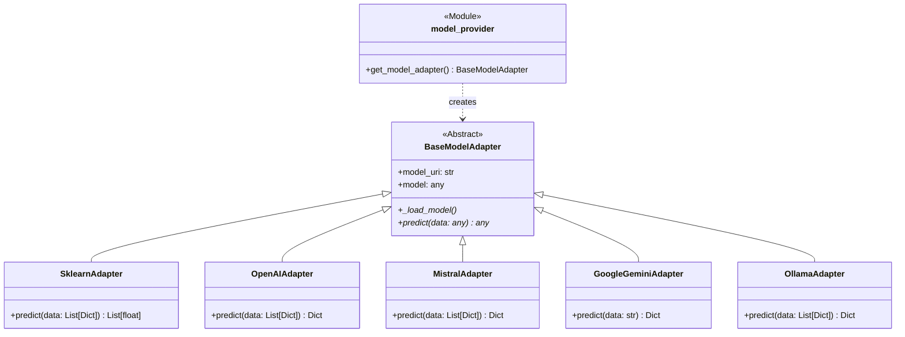

# Model Adapters and Configuration

A key design goal of this system is flexibility. The threat landscape changes, and the best AI model to use for analysis today might not be the best one tomorrow. To accommodate this, the system uses a **Model Adapter Pattern**.

## The `MODEL_URI` Scheme

Instead of using multiple environment variables to define the model, the system is configured with a single variable: `MODEL_URI`. This URI determines which model adapter is loaded and what model it will use.

The format is `scheme://path_or_model_name`.

| Scheme          | Example URI                                      | Adapter Loaded        | Description                                      |
| --------------- | ------------------------------------------------ | --------------------- | ------------------------------------------------ |
| `sklearn`       | `sklearn:///app/models/model.joblib`             | `SklearnAdapter`      | Loads a local scikit-learn model file.           |
| `markov`        | `markov://unused`                                | `MarkovAdapter`       | Generates a dynamic tarpit page using Markov chains. |
| `openai`        | `openai://gpt-4-turbo`                           | `OpenAIAdapter`       | Uses the OpenAI API with the specified model.    |
| `anthropic`     | `anthropic://claude-3-opus-20240229`             | `AnthropicAdapter`    | Calls the Anthropic API with the specified model. |
| `cohere`        | `cohere://command-r-plus`                        | `CohereAdapter`       | Uses the Cohere API with the specified model.    |
| `mistral`       | `mistral://mistral-large-latest`                 | `MistralAdapter`      | Uses the Mistral API with the specified model.   |
| `google-gemini` | `google-gemini://gemini-1.5-flash`               | `GoogleGeminiAdapter` | Uses the Google GenAI SDK with the specified model. |
| `ollama`        | `ollama://llama3`                                | `OllamaAdapter`       | Connects to a local Ollama server to use a model. |
| `llamacpp`      | `llamacpp:///app/models/model.gguf`              | `LlamaCppAdapter`     | Loads a local `gguf` model with llama-cpp-python. |
| `local-llm`     | `local-llm://http://localhost:8000/v1/chat/completions` | `LocalLLMApiAdapter` | Sends prompts to a locally hosted OpenAI-compatible API. |
| `external-api`  | `external-api://https://example.com/predict`     | `ExternalAPIAdapter`  | Calls the system's external classification API.  |
| `mcp`           | `mcp://risk-scorer/classify`                     | `MCPAdapter`          | Invokes a Model Context Protocol tool via websocket or stdio. |
| `http` / `https` | `https://my-custom-api.com/predict`              | `HttpModelAdapter`    | Calls a generic external prediction API.         |

> **Note**
> Use `HttpModelAdapter` when you simply need to POST JSON to any URL and interpret the response. `ExternalAPIAdapter` is a thin wrapper around this project's own classification API and assumes that service's request and response format.

## API Key Management

Each external service adapter is hardcoded to look for its own, uniquely named environment variable for its API key. This is a security best practice that prevents key confusion and ensures clear separation of credentials.

- **OpenAI:** `OPENAI_API_KEY`
- **Mistral:** `MISTRAL_API_KEY`
- **Google Gemini:** `GOOGLE_API_KEY` (or `GEMINI_API_KEY`)
- **Cohere:** `COHERE_API_KEY`
- **Anthropic:** `ANTHROPIC_API_KEY`

These keys should be set in your `.env` file for local development or managed via Kubernetes Secrets in production.

## Configuring MCP Servers

Set `MODEL_URI` to `mcp://<server_label>/<tool_name>` to use the `MCPAdapter`. Connection details come from environment variables that follow the pattern `MCP_SERVER_<LABEL>_*` (uppercase label). Common options include:

- `MCP_SERVER_<LABEL>_TRANSPORT` – `ws` (default) or `stdio`.
- `MCP_SERVER_<LABEL>_URL` – WebSocket endpoint when `ws` is used.
- `MCP_SERVER_<LABEL>_EXECUTABLE` / `MCP_SERVER_<LABEL>_ARGS` – Command and arguments when using `stdio`.
- `MCP_SERVER_<LABEL>_AUTH_TOKEN` – Optional bearer token (automatically mapped to the `Authorization` header).
- `MCP_SERVER_<LABEL>_HEADERS_JSON` / `MCP_SERVER_<LABEL>_ENV_JSON` – JSON payloads with additional headers or environment variables.
- `MCP_SERVER_<LABEL>_TIMEOUT` – Per-call timeout in seconds (defaults to `30`).

You can override individual settings per adapter instance by passing a config dictionary to `get_model_adapter` or by adding query parameters to the URI (for example, `mcp://risk-scorer/classify?timeout=45`).

> **Tip**
> Install the Python package with the appropriate extras for your transport, for example `pip install "mcp[websocket]"` when using WebSocket servers or `pip install "mcp[stdio]"` for process-based tools.

## Model Adapter Class Diagram

This diagram shows the design of the adapter pattern. All adapters inherit from a common `BaseModelAdapter`, which guarantees they all have a `.predict()` method. The `model_provider` factory function is responsible for creating the correct adapter based on the `MODEL_URI`.



## Handling Adapter Failures

`model_provider.get_model_adapter` will retry adapter initialization several times
in case of transient failures (for example, if a local model is still
downloading or a remote API briefly times out). The number of attempts and the
delay between them are controlled by the environment variables
`MODEL_ADAPTER_RETRIES` and `MODEL_ADAPTER_RETRY_DELAY` (defaults are `3` and
`1.0` seconds). If all attempts fail, the function returns `None` and the calling
service should gracefully fall back to heuristic scoring or other local logic.

## When Instantiation Fails

If `get_model_adapter` cannot create an adapter after all retries, it returns `None`. The caller should switch to a local or mock model so predictions continue.

For example:

```python
model_adapter = get_model_adapter(retries=3, delay=MODEL_ADAPTER_RETRY_DELAY)
if model_adapter is None:
    model_adapter = LocalHeuristicModel()
```

See [src/escalation/escalation_engine.py](../src/escalation/escalation_engine.py) for a real implementation.
